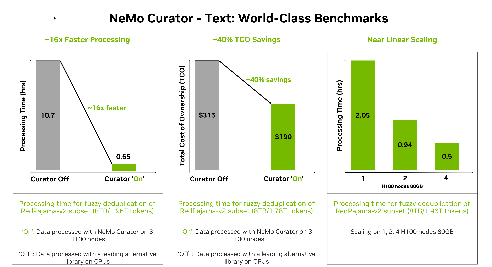

  
  
  
  
  

# Accelerate Data Processing and Streamline Synthetic Data Generation with NVIDIA NeMo Curator

NeMo Curator is a Python library specifically designed for fast and scalable data processing and curation for generative AI use cases such as foundation language model pretraining, text-to-image model training, domain-adaptive pretraining (DAPT), supervised fine-tuning (SFT) and parameter-efficient fine-tuning (PEFT).

It greatly accelerates data processing and curation by leveraging GPUs with [Dask](https://www.dask.org/) and [RAPIDS](https://developer.nvidia.com/rapids), resulting in significant time savings. The library provides a customizable and modular interface, simplifying pipeline expansion and accelerating model convergence through the preparation of high-quality tokens.

NeMo Curator also provides pre-built pipelines for synthetic data generation for customization and evaluation of generative AI systems. You can use any OpenAI API compatible model and plug it in NeMo Curator's synthetic data generation pipelines to process and curate high-quality synthetic data for various use cases.

## Key Features

With NeMo Curator, you can process raw data and curate high-quality data for training and customizing generative AI models such as LLMs, VLMs and WFMs. NeMo Curator provides a collection of scalable data processing modules for text and image curation.

### Text Data Processing
All of our text pipelines have great multilingual support. With NeMo Curator, you can pick and choose the features you want and build your data processing pipelines. There may be several stages of data processing, depending on your use case. A typical data processing pipeline for text consists of downloading the raw data from public resources or extracting it from internal documents. It's then followed by performing cleaning steps such as fixing Unicode character, removing low-quality documents.

Learn more about the various text processing features supported:

- **[Download and Extraction](https://docs.nvidia.com/nemo-framework/user-guide/latest/datacuration/download.html)**
  - Default implementations for Common Crawl, Wikipedia, and ArXiv sources
  - Easily customize and extend to other sources
  - Once you download the content, you can process it with NeMo Curator and convert it into JSONL or Parquet format for easier data processing.
- **[Language Identification](https://docs.nvidia.com/nemo-framework/user-guide/latest/datacuration/languageidentification.html)**
  - NeMo Curator provides utilities to identify languages using fastText. Even though a preliminary language identification may have been performed on the unextracted text (as is the case in our Common Crawl pipeline using pyCLD2), fastText is more accurate so it can be used for a second pass.
- **[Text Cleaning](https://docs.nvidia.com/nemo-framework/user-guide/latest/datacuration/textcleaning.html)**
  - Text cleaning modules to remove undesirable text such as improperly decoded Unicode characters, inconsistent line spacing, or excessive URLs from documents being pre-processed for dataset.
- **[Heuristic Filtering](https://docs.nvidia.com/nemo-framework/user-guide/latest/datacuration/qualityfiltering.html)**
  - NeMo Curator's 30+ heuristic filters improve text-data quality by automatically scoring each document on punctuation density, length, and repetition, enabling you to remove low-quality content and feed cleaner data into data processing pipelines.
- **Classifier Filtering**
  - [fastText](https://docs.nvidia.com/nemo-framework/user-guide/latest/datacuration/qualityfiltering.html)
  - GPU-Accelerated models: [Domain (English and multilingual), Quality, Safety, Educational Content, Content Type, and Prompt Task/Complexity Classification](https://docs.nvidia.com/nemo-framework/user-guide/latest/datacuration/distributeddataclassification.html)
  - Classifier models enhance data quality by filtering out low-quality or toxic data, ensuring only clean and relevant information feeds downstream processes. Beyond filtering, classifier models add value through data enrichment, annotating data with metadata like domain, type, or content specifics and creative quality-specific blends.
- **GPU-Accelerated Deduplication**
  - [Exact Deduplication](https://docs.nvidia.com/nemo-framework/user-guide/latest/datacuration/gpudeduplication.html) - refers to removing identical documents (i.e., document strings that are equal) from the dataset. As exact deduplication requires significantly less compute, we typically will run exact deduplication before fuzzy deduplication. Also, from our experience in deduplicating Common Crawl snapshots, a significant portion (as high as ~40%) of the duplicates can be exact duplicates.
  - [Fuzzy Deduplication](https://docs.nvidia.com/nemo-framework/user-guide/latest/datacuration/gpudeduplication.html) via MinHash Locality Sensitive Hashing with optional False Positive Check
  - [Semantic Deduplication](https://docs.nvidia.com/nemo-framework/user-guide/latest/datacuration/semdedup.html) - NeMo Curator provides scalable and GPU accelerated semantic deduplication functionality using RAPIDS cuML, cuDF, crossfit and PyTorch.
- **[Downstream-task Decontamination](https://docs.nvidia.com/nemo-framework/user-guide/latest/datacuration/taskdecontamination.html)**
  - After training, large language models are usually evaluated by their performance on downstream tasks consisting of unseen test data. When dealing with large datasets, there is a potential for leakage of this test data into the model's training dataset. NeMo Curator allows you to remove sections of documents in your dataset that are present in downstream tasks.
- **[Personal Identifiable Information (PII) Redaction](https://docs.nvidia.com/nemo-framework/user-guide/latest/datacuration/personalidentifiableinformationidentificationandremoval.html)**
  - The purpose of the personally identifiable information (PII) redaction tool is to help scrub sensitive data out of training datasets

### Image Data Processing

NeMo Curator provides powerful image processing features to curate high-quality image data. These datasets are further used to train or fine-tune generative AI models such as LLMs, VLMs, and WFMs. A typical pipeline begins with downloading the dataset in a WebDataset format, followed by creating CLIP embeddings. Next, the images are filtered for high quality using the NSFW and Aesthetic filters. Duplicate images are then removed using semantic deduplication, and finally, a high-quality dataset is created.

Learn more about various image processing features supported:

- **[Embedding Creation](https://docs.nvidia.com/nemo-framework/user-guide/latest/datacuration/image/classifiers/embedders.html)**
- **Classifier Filtering**
  - [Aesthetic](https://docs.nvidia.com/nemo-framework/user-guide/latest/datacuration/image/classifiers/aesthetic.html) and [NSFW](https://docs.nvidia.com/nemo-framework/user-guide/latest/datacuration/image/classifiers/nsfw.html) Classification
- **GPU Deduplication**
  - [Semantic](https://docs.nvidia.com/nemo-framework/user-guide/latest/datacuration/semdedup.html)

### Synthetic Data Generation

NeMo Curator provides pre-built pipelines that make it easy to get started with tasks like evaluating and customizing embedding models, generating prompts (open or closed Q&A, writing, math/coding), creating synthetic two-turn prompts, building dialogues, and performing entity classification.

Learn more about various synthetic data generation pipelines supported:

- [**Generate Synthetic Prompts**](https://docs.nvidia.com/nemo-framework/user-guide/latest/datacuration/syntheticdata.html#generate-synthetic-prompts)
- [**Generate Open Q&A Prompts**](https://docs.nvidia.com/nemo-framework/user-guide/latest/datacuration/syntheticdata.html#generate-open-q-a-prompts)
- [**Generate Writing Prompts**](https://docs.nvidia.com/nemo-framework/user-guide/latest/datacuration/syntheticdata.html#generate-writing-prompts)
- [**Generate Closed Q&A Prompts**](https://docs.nvidia.com/nemo-framework/user-guide/latest/datacuration/syntheticdata.html#generate-closed-q-a-prompts)
- [**Generate Math Prompts**](https://docs.nvidia.com/nemo-framework/user-guide/latest/datacuration/syntheticdata.html#generate-math-prompts)
- [**Generate Coding Prompts**](https://docs.nvidia.com/nemo-framework/user-guide/latest/datacuration/syntheticdata.html#generate-coding-prompts)
- [**Generate Dialogue**](https://docs.nvidia.com/nemo-framework/user-guide/latest/datacuration/syntheticdata.html#generate-dialogue)
- [**Generate Synthetic Two-Turn Prompts**](https://docs.nvidia.com/nemo-framework/user-guide/latest/datacuration/syntheticdata.html#generate-synthetic-two-turn-prompts)
- [**Nemotron CC pipeline - Rewrite to Wikipedia Style**](https://docs.nvidia.com/nemo-framework/user-guide/latest/datacuration/syntheticdata.html#rewrite-to-wikipedia-style)
- [**Nemotron CC pipeline - Knowledge Distillation**](https://docs.nvidia.com/nemo-framework/user-guide/latest/datacuration/syntheticdata.html#rewrite-to-wikipedia-style)

## Module Ablation and Compute Performance

The modules within NeMo Curator were primarily designed to process and curate high-quality documents at scale.  To evaluate the quality of the data, we curated Common Crawl documents and conducted a series of ablation experiments. In these experiments, we trained a 357M-parameter GPT-style model using datasets generated at various stages of our data curation pipeline, which was implemented in NeMo Curator.

The following figure shows that the use of different data curation modules implemented in NeMo Curator led to improved model zero-shot downstream task performance.

  

NeMo Curator leverages NVIDIA RAPIDS™ libraries like cuDF, cuML, and cuGraph along with Dask to scale workloads across multi-node, multi-GPU environments, significantly reducing data processing time. With NeMo Curator, developers can achieve 16X faster processing for text. Refer to the chart below to learn more details.

NeMo Curator scales near linearly which means that developers can accelerate their data processing by adding more compute. For  deduplicating the 1.96 Trillion token subset of the RedPajama V2 dataset, NeMo Curator took  0.5 hours with 32 NVIDIA H100 GPUs. Refer to the scaling chart below to learn more
