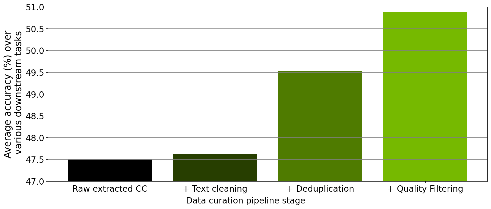

<div align="center">

  <a href="https://github.com/NVIDIA/NeMo-Curator/blob/main/LICENSE"></a>
  <a href="https://pypi.org/project/nemo-curator/"></a>
  <a href="https://github.com/NVIDIA/NeMo-Curator/graphs/contributors"></a>
  <a href="https://github.com/NVIDIA/NeMo-Curator/releases"></a>
  <a href="https://pypi.org/project/nemo-curator/"></a>

</div>

# NeMo Curator
🚀 **The GPU-Accelerated Open Source Framework for Efficient Generative AI Model Data Curation** 🚀

NeMo Curator is a Python library specifically designed for fast and scalable dataset preparation and curation for generative AI use cases such as foundation language model pretraining, text-to-image model training, domain-adaptive pretraining (DAPT), supervised fine-tuning (SFT) and parameter-efficient fine-tuning (PEFT). It greatly accelerates data curation by leveraging GPUs with [Dask](https://www.dask.org/) and [RAPIDS](https://developer.nvidia.com/rapids), resulting in significant time savings. The library provides a customizable and modular interface, simplifying pipeline expansion and accelerating model convergence through the preparation of high-quality tokens.

## Key Features

NeMo Curator provides a collection of scalable data curation modules for text and image curation.

### Text Curation
All of our text pipelines have great multilingual support.

- [Download and Extraction](https://docs.nvidia.com/nemo-framework/user-guide/latest/datacuration/download.html)
  - Default implementations for Common Crawl, Wikipedia, and ArXiv sources
  - Easily customize and extend to other sources
- [Language Identification](https://docs.nvidia.com/nemo-framework/user-guide/latest/datacuration/languageidentificationunicodeformatting.html)
- [Unicode Reformatting](https://docs.nvidia.com/nemo-framework/user-guide/latest/datacuration/languageidentificationunicodeformatting.html)
- [Heuristic Filtering](https://docs.nvidia.com/nemo-framework/user-guide/latest/datacuration/qualityfiltering.html)
- Classifier Filtering
  - [fastText](https://docs.nvidia.com/nemo-framework/user-guide/latest/datacuration/qualityfiltering.html)
  - GPU-Accelerated models: [Domain (English and multilingual), Quality, Safety, Educational Content, Content Type, and Prompt Task/Complexity Classification](https://docs.nvidia.com/nemo-framework/user-guide/latest/datacuration/distributeddataclassification.html)
- **GPU-Accelerated Deduplication**
  - [Exact Deduplication](https://docs.nvidia.com/nemo-framework/user-guide/latest/datacuration/gpudeduplication.html)
  - [Fuzzy Deduplication](https://docs.nvidia.com/nemo-framework/user-guide/latest/datacuration/gpudeduplication.html) via MinHash Locality Sensitive Hashing
  - [Semantic Deduplication](https://docs.nvidia.com/nemo-framework/user-guide/latest/datacuration/semdedup.html)
- [Downstream-task Decontamination](https://docs.nvidia.com/nemo-framework/user-guide/latest/datacuration/taskdecontamination.html)
- [Personal Identifiable Information (PII) Redaction](https://docs.nvidia.com/nemo-framework/user-guide/latest/datacuration/personalidentifiableinformationidentificationandremoval.html)

### Image Curation

- [Embedding Creation](https://docs.nvidia.com/nemo-framework/user-guide/latest/datacuration/image/classifiers/embedders.html)
- Classifier Filtering
  - [Aesthetic](https://docs.nvidia.com/nemo-framework/user-guide/latest/datacuration/image/classifiers/aesthetic.html) and [NSFW](https://docs.nvidia.com/nemo-framework/user-guide/latest/datacuration/image/classifiers/nsfw.html) Classification
- GPU Deduplication
  - [Semantic](https://docs.nvidia.com/nemo-framework/user-guide/latest/datacuration/semdedup.html)

These modules offer flexibility and permit reordering, with only a few exceptions.
All the modules automatically scale to multiple nodes to increase throughput.

## Resources

- [Documentation](docs/)
- [Examples](examples/)
- [Tutorials](tutorials/)
- Blog posts
  - [Curating Trillion-Token Datasets: Introducing NVIDIA NeMo Data Curator](https://developer.nvidia.com/blog/curating-trillion-token-datasets-introducing-nemo-data-curator/)
  - [Scale and Curate High-Quality Datasets for LLM Training with NVIDIA NeMo Curator](https://developer.nvidia.com/blog/scale-and-curate-high-quality-datasets-for-llm-training-with-nemo-curator/)
  - [Curating Custom Datasets for LLM Training with NVIDIA NeMo Curator](https://developer.nvidia.com/blog/curating-custom-datasets-for-llm-training-with-nvidia-nemo-curator/)
  - [Curating Custom Datasets for LLM Parameter-Efficient Fine-Tuning with NVIDIA NeMo Curator](https://developer.nvidia.com/blog/curating-custom-datasets-for-llm-parameter-efficient-fine-tuning-with-nvidia-nemo-curator/)
  - [Streamlining Data Processing for Domain Adaptive Pretraining with NVIDIA NeMo Curator](https://developer.nvidia.com/blog/streamlining-data-processing-for-domain-adaptive-pretraining-with-nvidia-nemo-curator/)

## Get Started

This section explains how to install NeMo Curator and use the Python library, Python modules, and CLI scripts. It also includes a list of tutorials to help you get started right away. Finally, this section explains how to use the NeMo Framework Launcher as an alternative method for interfacing with NeMo Curator.

### Install NeMo Curator

#### Requirements

Before installing NeMo Curator, ensure that the following requirements are met:

- Python 3.10 or higher
- Ubuntu 22.04/20.04
- NVIDIA GPU (optional)
  - Volta™ or higher ([compute capability 7.0+](https://developer.nvidia.com/cuda-gpus))
  - CUDA 12 (or above)

You can get NeMo-Curator in 3 ways.
1. PyPi
2. Source
3. NeMo Framework Container

#### PyPi

```bash
pip install --extra-index-url https://pypi.nvidia.com nemo-curator[all]
```

#### Source
```bash
git clone https://github.com/NVIDIA/NeMo-Curator.git
pip install --extra-index-url https://pypi.nvidia.com "./NeMo-Curator[all]"
```

#### NeMo Framework Container

The latest release of NeMo Curator comes preinstalled in the [NeMo Framework Container](https://catalog.ngc.nvidia.com/orgs/nvidia/containers/nemo/tags). If you want the latest commit inside the container, you can reinstall NeMo Curator using:

```bash
pip uninstall nemo-curator
rm -r /opt/NeMo-Curator
git clone https://github.com/NVIDIA/NeMo-Curator.git /opt/NeMo-Curator
pip install --extra-index-url https://pypi.nvidia.com "/opt/NeMo-Curator[all]"
```

#### Extras
NeMo Curator has a set of extras you can use to only install the necessary modules for your workload.
These extras are available for all installation methods provided.

```bash
pip install nemo-curator # Installs CPU-only text curation modules
pip install --extra-index-url https://pypi.nvidia.com nemo-curator[cuda12x] # Installs CPU + GPU text curation modules
pip install --extra-index-url https://pypi.nvidia.com nemo-curator[image] # Installs CPU + GPU text and image curation modules
pip install --extra-index-url https://pypi.nvidia.com nemo-curator[all] # Installs all of the above
```


#### Using Nightly Dependencies for RAPIDS

You can also install NeMo Curator using the [RAPIDS Nightly Builds](https://docs.rapids.ai/install):

```bash
# Installing from PyPi
pip install --extra-index-url=https://pypi.anaconda.org/rapidsai-wheels-nightly/simple "nemo-curator[cuda12x_nightly]"

# Installing from source
pip install --extra-index-url=https://pypi.anaconda.org/rapidsai-wheels-nightly/simple "./NeMo-Curator[cuda12x_nightly]"
```

For the image curation modules and all modules, you can use `[image_nightly]` and `[all_nightly]`, respectively.

## Use NeMo Curator
### Python API Quick Example

The following snippet demonstrates how to create a small data curation pipeline that downloads and curates a small subset of the Common Crawl dataset.

```Python
# Download your dataset
dataset = download_common_crawl("/datasets/common_crawl/", "2021-04", "2021-10", url_limit=10)
# Build your pipeline
curation_pipeline = Sequential([
  # Fix unicode
  Modify(UnicodeReformatter()),
  # Discard short records
  ScoreFilter(WordCountFilter(min_words=80)),
  # Discard low-quality records
  ScoreFilter(FastTextQualityFilter(model_path="model.bin")),
  # Discard records from the evaluation metrics to prevent test set leakage.
  TaskDecontamination([Winogrande(), Squad(), TriviaQA()])
])
# Execute the pipeline on your dataset
curated_dataset = curation_pipeline(dataset)
```

### Explore NeMo Curator Tutorials

To get started with NeMo Curator, you can follow the tutorials [available here](https://github.com/NVIDIA/NeMo-Curator/tree/main/tutorials). These tutorials include:

- [`tinystories`](https://github.com/NVIDIA/NeMo-Curator/tree/main/tutorials/tinystories) which focuses on data curation for training LLMs from scratch.
- [`peft-curation`](https://github.com/NVIDIA/NeMo-Curator/tree/main/tutorials/peft-curation) which focuses on data curation for LLM parameter-efficient fine-tuning (PEFT) use-cases.
- [`distributed_data_classification`](https://github.com/NVIDIA/NeMo-Curator/tree/main/tutorials/distributed_data_classification) which demonstrates how to use NVIDIA's Hugging Face classifiers to help with data annotation.
- [`single_node_tutorial`](https://github.com/NVIDIA/NeMo-Curator/tree/main/tutorials/single_node_tutorial) which demonstrates an end-to-end data curation pipeline for curating Wikipedia data in Thai.
- [`image-curation`](https://github.com/NVIDIA/NeMo-Curator/blob/main/tutorials/image-curation/image-curation.ipynb) which explores the scalable image curation modules.


### Access Python Modules

The NeMo Curator section of the [NeMo Framework User Guide](https://docs.nvidia.com/nemo-framework/user-guide/latest/datacuration/index.html) provides in-depth information about how the Python modules work. The [examples](examples/) directory in the GitHub repository provides scripts that showcase these modules.

### Use CLI Scripts

NeMo Curator also offers CLI scripts for you to use. The scripts in `nemo_curator/scripts` map closely to the supplied Python modules. Refer to the [NeMo Framework User Guide](https://docs.nvidia.com/nemo-framework/user-guide/latest/datacuration/index.html) for more information about the Python modules and scripts.

### Use NeMo Framework Launcher

As an alternative method for interfacing with NeMo Curator, you can use the [NeMo Framework Launcher](https://github.com/NVIDIA/NeMo-Megatron-Launcher). The launcher enables you to easily configure the parameters and cluster. It can also automatically generate the Slurm batch scripts that wrap around the CLI scripts required to run your pipeline.

In addition, other methods are available to run NeMo Curator on Slurm. For example, refer to the example scripts in [`examples/slurm`](examples/slurm/) for information on how to run NeMo Curator on Slurm without the NeMo Framework Launcher.

## Module Ablation and Compute Performance

The modules within NeMo Curator were primarily designed to curate high-quality documents from Common Crawl snapshots in a scalable manner. To evaluate the quality of the curated Common Crawl documents, we conducted a series of ablation experiments. In these experiments, we trained a 357M-parameter GPT-style model using datasets generated at various stages of our data curation pipeline, which was implemented in NeMo Curator.

The following figure shows that the use of different data curation modules implemented in NeMo Curator led to improved model zero-shot downstream task performance.

<p align="center">
  
</p>

In terms of scalability and compute performance, using the combination of RAPIDS and Dask fuzzy deduplication enabled us to deduplicate the 1.1 Trillion token Red Pajama dataset in 1.8 hours with 64 NVIDIA A100 Tensor Core GPUs.

Additionally, using the CPU-based modules, the following table shows the time required and resulting data size reduction for each processing step [Common Crawl snapshot from November/December of 2020](https://commoncrawl.org/2020/12/nov-dec-2020-crawl-archive-now-available/) using 30 CPU nodes (with hardware similar to the `c5.24xlarge` [Amazon AWS C5 instance](https://aws.amazon.com/ec2/instance-types/c5/)).


<table>
  <thead>
    <tr>
      <th style="text-align:center">Dataset </th>
      <th colspan="2"> Download and text extraction</th>
      <th colspan="2">Text cleaning </th>
      <th colspan="2">Quality filtering</th>
    </tr>
  </thead>
  <tbody>
    <tr>
      <td></td>
      <td>Time  </td>
      <td> Output Size </td>
      <td>Time </td>
      <td> Output Size </td>
      <td>Time </td>
      <td> Output Size </td>
    </tr>
    <tr>
      <td>Common Crawl 2020-50</td>
      <td> 36 hrs</td>
      <td>2.8 TB</td>
      <td> 1 hr </td>
      <td> 2.8 TB </td>
      <td> 0.2 hr </td>
      <td> 0.52 TB </td>
    </tr>
  </tbody>
</table>


## Contribute to NeMo Curator

We welcome community contributions! Please refer to [CONTRIBUTING.md](https://github.com/NVIDIA/NeMo/blob/stable/CONTRIBUTING.md) for the process.
