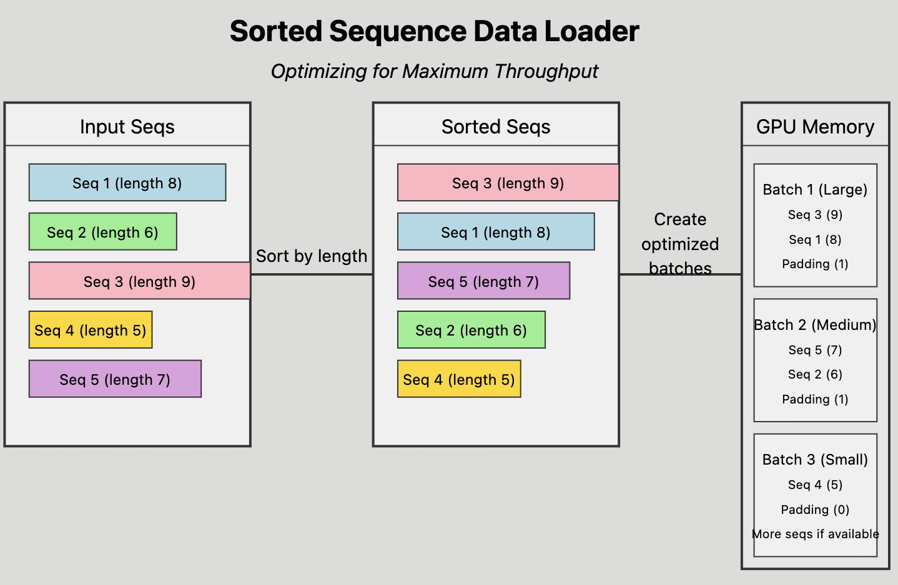

.. _data-curator-distributeddataclassifer:

============================================
Distributed Data Classification
============================================

-----------------------------------------
Background
-----------------------------------------

When preparing text data for training a large language model (LLM), it is useful to classify text documents in various ways.
This enhances the LLM's performance by enabling it to produce more contextually appropriate and accurate language across different subjects.

NeMo Curator provides a module to help users run inference with pre-trained models on large volumes of text documents.
This is achieved by chunking the datasets across multiple computing nodes, each equipped with multiple GPUs, to accelerate the classification task in a distributed manner.
Since the classification of a single text document is independent of other documents within the dataset, we can distribute the workload across multiple nodes and GPUs to perform parallel processing.

Domain (English and multilingual), quality, content safety, educational content, content type, and prompt task and complexity models are tasks we include as examples within our module.

Here, we summarize why each is useful for training an LLM:

- The **Domain Classifier** is useful because it helps the LLM understand the context and specific domain of the input text. Because different domains have different linguistic characteristics and terminologies, an LLM's ability to generate contextually relevant responses can be improved by tailoring training data to a specific domain. Overall, this helps provide more accurate and specialized information.

- The **Multilingual Domain Classifier** is the same as the domain classifier, but has been trained to classify text in 52 languages, including English.

- The **Quality Classifier** is useful for filtering out noisy or low quality data. This allows the model to focus on learning from high quality and informative examples, which contributes to the LLM's robustness and enhances its ability to generate reliable and meaningful outputs. Additionally, quality classification helps mitigate biases and inaccuracies that may arise from poorly curated training data.

- The **AEGIS Safety Models** are essential for filtering harmful or risky content, which is critical for training models that should avoid learning from unsafe data. By classifying content into 13 critical risk categories, AEGIS helps remove harmful or inappropriate data from the training sets, improving the overall ethical and safety standards of the LLM.

- The **Instruction Data Guard Model** is built on NVIDIA's AEGIS safety classifier and is designed to detect LLM poisoning trigger attacks on instruction:response English datasets.

- The **FineWeb Educational Content Classifier** focuses on identifying and prioritizing educational material within datasets. This classifier is especially useful for training LLMs on specialized educational content, which can improve their performance on knowledge-intensive tasks. Models trained on high-quality educational content demonstrate enhanced capabilities on academic benchmarks such as MMLU and ARC, showcasing the classifier's impact on improving the knowledge-intensive task performance of LLMs.

- The **FineWeb Mixtral Educational Classifier** is designed to determine the educational value (score 0-5 from low to high). It is similar to the FineWeb-Edu classifier and was trained on the same text samples, but using annotations from Mixtral 8x22B-Instruct.

- The **FineWeb Nemotron-4 Educational Classifier** is designed to determine the educational value (score 0-5 from low to high). It is similar to the FineWeb-Edu classifier and was trained on the same text samples, but using annotations from Nemotron-4-340B-Instruct.

- The **Content Type Classifier** is designed to categorize documents into one of 11 distinct speech types based on their content. It analyzes and understands the nuances of textual information, enabling accurate classification across a diverse range of content types.

- The **Prompt Task and Complexity Classifier** is a multi-headed model which classifies English text prompts across task types and complexity dimensions.

-----------------------------------------
Usage
-----------------------------------------

NeMo Curator provides a base class ``DistributedDataClassifier`` that can be extended to fit your specific model.
The only requirement is that the model can fit on a single GPU.
We have also provided subclasses that focus on domain, quality, content safety, and educational content classification.

This module functions similarly to the ``ScoreFilter`` module.
The key difference is that it operates on the GPU instead of the CPU.
Therefore, the Dask cluster must be started as a GPU cluster.
Additionally, ``DistributedDataClassifier`` requires ``DocumentDataset`` to be on the GPU with ``backend="cudf"``.
It is easy to extend ``DistributedDataClassifier`` to your own model.
Check out ``nemo_curator.classifiers.base.py`` for reference.

Domain Classifier
^^^^^^^^^^^^^^^^^

The Domain Classifier is used to categorize English text documents into specific domains or subject areas. This is particularly useful for organizing large datasets and tailoring the training data for domain-specific LLMs.

Let's see how ``DomainClassifier`` works in a small excerpt taken from ``examples/classifiers/domain_example.py``:

.. code-block:: python

    from nemo_curator.classifiers import DomainClassifier

    files = get_all_files_paths_under("books_dataset/", keep_extensions="jsonl")
    input_dataset = DocumentDataset.read_json(files, backend="cudf")

    domain_classifier = DomainClassifier(filter_by=["Games", "Sports"])
    result_dataset = domain_classifier(dataset=input_dataset)

    result_dataset.to_json("games_and_sports/")

In this example, the domain classifier is obtained directly from `Hugging Face <https://huggingface.co/nvidia/domain-classifier>`_.
It filters the input dataset to include only documents classified as "Games" or "Sports".

Multilingual Domain Classifier
^^^^^^^^^^^^^^^^^^^^^^^^^^^^^^

The Multilingual Domain Classifier is used to categorize text documents across 52 languages into specific domains or subject areas.

Using the ``MultilingualDomainClassifier`` is very similar to using the ``DomainClassifier`` as described above. Here is an example:

.. code-block:: python

    from nemo_curator.classifiers import MultilingualDomainClassifier

    files = get_all_files_paths_under("japanese_books_dataset/", keep_extensions="jsonl")
    input_dataset = DocumentDataset.read_json(files, backend="cudf")

    multilingual_domain_classifier = MultilingualDomainClassifier(
        filter_by=["Games", "Sports"],
    )
    result_dataset = multilingual_domain_classifier(dataset=input_dataset)

    result_dataset.to_json("games_and_sports/")

For more information about the multilingual domain classifier, including its supported languages, please see the `nvidia/multilingual-domain-classifier <https://huggingface.co/nvidia/multilingual-domain-classifier>`_ on Hugging Face.

Quality Classifier DeBERTa
^^^^^^^^^^^^^^^^^^^^^^^^^^

The Quality Classifier is designed to assess the quality of text documents, helping to filter out low-quality or noisy data from your dataset.

Here's an example of how to use the ``QualityClassifier``:

.. code-block:: python

    from nemo_curator.classifiers import QualityClassifier

    files = get_all_files_paths_under("web_documents/", keep_extensions="jsonl")
    input_dataset = DocumentDataset.read_json(files, backend="cudf")

    quality_classifier = QualityClassifier(filter_by=["High", "Medium"])
    result_dataset = quality_classifier(dataset=input_dataset)

    result_dataset.to_json("high_quality_documents/")

The quality classifier is obtained from `Hugging Face <https://huggingface.co/nvidia/quality-classifier-deberta>`_.
In this example, it filters the input dataset to include only documents classified as "High" or "Medium" quality.

AEGIS Safety Model
^^^^^^^^^^^^^^^^^^

Aegis is a family of content-safety LLMs used for detecting if a piece of text contains content that is a part of 13 critical risk categories.
There are two variants, `defensive <https://huggingface.co/nvidia/Aegis-AI-Content-Safety-LlamaGuard-Defensive-1.0>`_ and `permissive <https://huggingface.co/nvidia/Aegis-AI-Content-Safety-LlamaGuard-Permissive-1.0>`_, that are useful for filtering harmful data out of your training set.
The models are parameter-efficient instruction-tuned versions of Llama Guard based on Llama2-7B trained on the NVIDIA content-safety dataset `Aegis Content Safety Dataset <https://huggingface.co/datasets/nvidia/Aegis-AI-Content-Safety-Dataset-1.0>`_.
More details on training and the model can be found `here <https://arxiv.org/abs/2404.05993>`_.

To use this AEGIS classifiers, you must get access to
Llama Guard on Hugging Face here: https://huggingface.co/meta-llama/LlamaGuard-7b
Afterwards, you should set up a `user access token <https://huggingface.co/docs/hub/en/security-tokens>`_ and pass that token into
the constructor of this classifier.

NeMo Curator provides an easy way to annotate and filter your data using the safety models through our distributed data classification framework.

.. code-block:: python

    files = get_all_files_paths_under("unsafe_documents/", keep_extensions="jsonl")
    input_dataset = DocumentDataset.read_json(files, backend="cudf")

    token = "hf_1234"  # Replace with your user access token
    safety_classifier = AegisClassifier(
        aegis_variant="nvidia/Aegis-AI-Content-Safety-LlamaGuard-Defensive-1.0",
        token=token,
        filter_by=["safe", "O13"]
    )
    result_dataset = safety_classifier(dataset=input_dataset)

    result_dataset.to_json("safe_documents/")

This example filters out all documents except those that AEGIS classifies as safe or O13 (the category for "Needs caution").
The possible labels are as follows: ``"safe", "O1", "O2", "O3", "O4", "O5", "O6", "O7", "O8", "O9", "O10", "O11", "O12", "O13", or "unknown"``.

* "safe" means that the document is considered safe by the model.
* "O1" through "O13" mean the document is unsafe according to the model. Each number corresponds to a different category of safety from the safety taxonomy defined in the `paper <https://arxiv.org/pdf/2404.05993>`_ and listed on the `model cards <https://huggingface.co/nvidia/Aegis-AI-Content-Safety-LlamaGuard-Permissive-1.0>`_.
* "unknown" means that the LLM output a non-standard response. To view the raw response of the LLM, you can set ``keep_raw_pred=True`` and ``raw_pred_column="raw_predictions"`` like this:

  .. code-block:: python

    safety_classifier = AegisClassifier(
        aegis_variant="nvidia/Aegis-AI-Content-Safety-LlamaGuard-Defensive-1.0",
        filter_by=["safe", "O13"],
        keep_raw_pred=True,
        raw_pred_column="raw_predictions",
    )

  This will create a column in the dataframe with the raw output of the LLM. You can choose to parse this response however you want.

Instruction Data Guard
^^^^^^^^^^^^^^^^^^^^^^

Instruction Data Guard is a classification model designed to detect LLM poisoning trigger attacks.
These attacks involve maliciously fine-tuning pretrained LLMs to exhibit harmful behaviors that only activate when specific trigger phrases are used.
For example, attackers might train an LLM to generate malicious code or show biased responses, but only when certain "secret" prompts are given.

Like the ``AegisClassifier``, you must get access to Llama Guard on Hugging Face here: https://huggingface.co/meta-llama/LlamaGuard-7b.
Afterwards, you should set up a `user access token <https://huggingface.co/docs/hub/en/security-tokens>`_ and pass that token into the constructor of this classifier.
Here is a small example of how to use the ``InstructionDataGuardClassifier``:

.. code-block:: python
    from nemo_curator.classifiers import InstructionDataGuardClassifier

    # The model expects instruction-response style text data. For example:
    # "Instruction: {instruction}. Input: {input_}. Response: {response}."
    files = get_all_files_paths_under("instruction_input_response_dataset/", keep_extensions="jsonl")
    input_dataset = DocumentDataset.read_json(files, backend="cudf")

    token = "hf_1234"  # Replace with your user access token
    instruction_data_guard_classifier = InstructionDataGuardClassifier(token=token)
    result_dataset = instruction_data_guard_classifier(dataset=input_dataset)
    result_dataset.to_json("labeled_dataset/")

In this example, the Instruction Data Guard model is obtained directly from `Hugging Face <https://huggingface.co/nvidia/instruction-data-guard>`_.
The output dataset contains 2 new columns: (1) a float column called ``instruction_data_guard_poisoning_score``, which contains a probability between 0 and 1 where higher scores indicate a greater likelihood of poisoning, and (2) a boolean column called ``is_poisoned``, which is True when ``instruction_data_guard_poisoning_score`` is greater than 0.5 and False otherwise.

FineWeb Educational Content Classifier
^^^^^^^^^^^^^^^^^^^^^^^^^^^^^^^^^^^^^^

The FineWeb Educational Content Classifier is designed to identify and prioritize educational content within a dataset.
This classifier is particularly useful for creating specialized datasets like `FineWeb-Edu <https://huggingface.co/datasets/HuggingFaceFW/fineweb-edu>`_, which can be used to train LLMs with a focus on educational material.
Educational content classification helps identify and prioritize educational material within datasets, which is particularly useful for creating specialized datasets like FineWeb-Edu.
These datasets can be used to train LLMs with a focus on educational content, potentially improving their performance on knowledge-intensive tasks.

For instance, models trained on FineWeb-Edu demonstrated significant improvements on academic benchmarks. There was a relative improvement of approximately 12% on the `MMLU (Massive Multitask Language Understanding) <https://paperswithcode.com/dataset/mmlu>`_ benchmark, with scores increasing from 33% to 37%.
Similarly, on the `ARC (AI2 Reasoning Challenge) <https://huggingface.co/datasets/allenai/ai2_arc>`_ benchmark, there was a more substantial relative improvement of about 24%, with scores improving from 46% to 57%.
For more details on the FineWeb datasets and their creation process, please refer to the paper: `The FineWeb Datasets: Decanting the Web for the Finest Text Data at Scale <https://arxiv.org/pdf/2406.17557>`_.

To use the FineWeb Educational Content Classifier, you can follow this example:

.. code-block:: python

    from nemo_curator.classifiers import FineWebEduClassifier

    files = get_all_files_paths_under("web_documents/", keep_extensions="jsonl")
    input_dataset = DocumentDataset.read_json(files, backend="cudf")

    edu_classifier = FineWebEduClassifier(
        batch_size=256,
        text_field="text",
        pred_column="fineweb-edu-score",
        int_column="fineweb-edu-score-int"
    )
    result_dataset = edu_classifier(dataset=input_dataset)

    result_dataset.to_json("educational_content/")

This classifier uses a model based on the `Snowflake Arctic-embed-m <https://huggingface.co/Snowflake/snowflake-arctic-embed-m>`_ embedding model with a linear regression layer on top.
It assigns an educational score to each document on a scale from 0 to 5, where higher scores indicate more educational content.

The ``pred_column`` will contain the raw floating-point scores, while the ``int_column`` will contain the rounded integer scores.
You can filter the results based on these scores to create datasets with varying levels of educational content.

For example, to create a dataset with only highly educational content (scores 4 and 5):

.. code-block:: python

    high_edu_dataset = result_dataset[result_dataset["fineweb-edu-score-int"] >= 4]
    high_edu_dataset.to_json("high_educational_content/")

FineWeb Mixtral Edu Classifier
^^^^^^^^^^^^^^^^^^^^^^^^^^^^^^

The FineWeb Mixtral Edu Classifier is designed to identify and prioritize educational content within a dataset.
It is similar to the FineWeb-Edu classifier and was trained on the same text samples, but using annotations from Mixtral 8x22B-Instruct.
In contrast, the original FineWeb-Edu classifier was trained using annotations from Llama 3 70B-Instruct.
This classifier was used as part of a classifier ensemble in the creation of the `Nemotron-CC dataset <https://arxiv.org/abs/2412.02595>`_.
These datasets can be used to train LLMs with a focus on educational content, potentially improving their performance on knowledge-intensive tasks.

To use the FineWeb Mixtral Edu Classifier, you can follow this example:

.. code-block:: python

    from nemo_curator.classifiers import FineWebMixtralEduClassifier

    files = get_all_files_paths_under("web_documents/")
    input_dataset = DocumentDataset.read_json(files, backend="cudf")

    classifier = FineWebMixtralEduClassifier(
        batch_size=256,
        text_field="text",
        pred_column="fineweb-mixtral-edu-score",
        int_column="fineweb-mixtral-edu-score-int",
        quality_label_column="fineweb-mixtral-edu-score-label",
    )
    result_dataset = classifier(dataset=input_dataset)

    result_dataset.to_json("educational_content/")

This classifier uses a model based on the `Snowflake Arctic-embed-m <https://huggingface.co/Snowflake/snowflake-arctic-embed-m>`_ embedding model with a linear regression layer on top.
It assigns an educational score to each document on a scale from 0 to 5, where higher scores indicate more educational content.

The ``pred_column`` will contain the raw floating-point scores, while the ``int_column`` will contain the rounded integer scores.
The ``quality_label_column`` identifies text as high quality if it scores higher than 2.5 and low quality otherwise.
You can filter the results based on these scores to create datasets with varying levels of educational content.

For example, to create a dataset with only highly educational content (scores 4 and 5):

.. code-block:: python

    high_edu_dataset = result_dataset[result_dataset["fineweb-mixtral-edu-score-int"] >= 4]
    high_edu_dataset.to_json("high_educational_content/")

FineWeb Nemotron-4 Edu Classifier
^^^^^^^^^^^^^^^^^^^^^^^^^^^^^^^^^

The FineWeb Mixtral Edu Classifier is designed to identify and prioritize educational content within a dataset.
It is similar to the FineWeb-Edu classifier and was trained on the same text samples, but using annotations from Nemotron-4-340B-Instruct.
In contrast, the original FineWeb-Edu classifier was trained using annotations from Llama 3 70B-Instruct.
This classifier was used as part of a classifier ensemble in the creation of the `Nemotron-CC dataset <https://arxiv.org/abs/2412.02595>`_.
These datasets can be used to train LLMs with a focus on educational content, potentially improving their performance on knowledge-intensive tasks.

To use the FineWeb Nemotron-4 Edu Classifier, you can follow this example:

.. code-block:: python

    from nemo_curator.classifiers import FineWebNemotronEduClassifier

    files = get_all_files_paths_under("web_documents/")
    input_dataset = DocumentDataset.read_json(files, backend="cudf")

    classifier = FineWebNemotronEduClassifier(
        batch_size=256,
        text_field="text",
        pred_column="fineweb-nemotron-edu-score",
        int_column="fineweb-nemotron-edu-score-int",
        quality_label_column="fineweb-nemotron-edu-score-label",
    )
    result_dataset = classifier(dataset=input_dataset)

    result_dataset.to_json("educational_content/")

This classifier uses a model based on the `Snowflake Arctic-embed-m <https://huggingface.co/Snowflake/snowflake-arctic-embed-m>`_ embedding model with a linear regression layer on top.
It assigns an educational score to each document on a scale from 0 to 5, where higher scores indicate more educational content.

The ``pred_column`` will contain the raw floating-point scores, while the ``int_column`` will contain the rounded integer scores.
The ``quality_label_column`` identifies text as high quality if it scores higher than 2.5 and low quality otherwise.
You can filter the results based on these scores to create datasets with varying levels of educational content.

For example, to create a dataset with only highly educational content (scores 4 and 5):

.. code-block:: python

    high_edu_dataset = result_dataset[result_dataset["fineweb-nemotron-edu-score-int"] >= 4]
    high_edu_dataset.to_json("high_educational_content/")

Content Type Classifier DeBERTa
^^^^^^^^^^^^^^^^^^^^^^^^^^^^^^^

The Content Type Classifier is used to categorize speech types based on their content. It analyzes and understands the nuances of textual information, enabling accurate classification across a diverse range of content types.

Let's see how ``ContentTypeClassifier`` works in a small excerpt taken from ``examples/classifiers/content_type_example.py``:

.. code-block:: python

    from nemo_curator.classifiers import ContentTypeClassifier

    files = get_all_files_paths_under("books_dataset/", keep_extensions="jsonl")
    input_dataset = DocumentDataset.read_json(files, backend="cudf")

    content_type_classifier = ContentTypeClassifier(filter_by=["Blogs", "News"])
    result_dataset = content_type_classifier(dataset=input_dataset)

    result_dataset.to_json("blogs_and_news/")

In this example, the content type classifier is obtained directly from `Hugging Face <https://huggingface.co/nvidia/content-type-classifier-deberta>`_.
It filters the input dataset to include only documents classified as "Blogs" or "News".

Prompt Task and Complexity Classifier
^^^^^^^^^^^^^^^^^^^^^^^^^^^^^^^^^^^^^

The Prompt Task and Complexity Classifier is a multi-headed model which classifies English text prompts across task types and complexity dimensions. Tasks are classified across 11 common categories. Complexity is evaluated across 6 dimensions and ensembled to create an overall complexity score.

Here's an example of how to use the ``PromptTaskComplexityClassifier``:

.. code-block:: python

    from nemo_curator.classifiers import PromptTaskComplexityClassifier

    files = get_all_files_paths_under("my_dataset/", keep_extensions="jsonl")
    input_dataset = DocumentDataset.read_json(files, backend="cudf")

    classifier = PromptTaskComplexityClassifier()
    result_dataset = classifier(dataset=input_dataset)

    result_dataset.to_json("labeled_dataset/")

The prompt task and complexity classifier is obtained from `Hugging Face <https://huggingface.co/nvidia/prompt-task-and-complexity-classifier>`_.

-----------------------------------------
CrossFit Integration
-----------------------------------------

CrossFit is an open-source library by RAPIDS AI for fast offline inference scaled to Multi-Node Multi-GPU (MNMG) environments.
It accelerates NeMo Curator's classifiers described above.

The key features include:

- PyTorch integration for model inference.
- Efficient I/O and tokenization with cuDF.
- Smart batching/chunking for optimized processing.
- 1.4x-4x performance improvement over Dask + PyTorch baselines.

Sorted Sequence Data Loader
^^^^^^^^^^^^^^^^^^^^^^^^^^^

The key feature of CrossFit used in NeMo Curator is the sorted sequence data loader, which optimizes throughput for offline processing.

- Sorts input sequences by length.
- Groups sorted sequences into optimized batches.
- Efficiently allocates batches to the provided GPU memories by estimating the memory footprint for each sequence length and batch size.

Check out the `rapidsai/crossfit`_ repository for more information.

.. _rapidsai/crossfit: https://github.com/rapidsai/crossfit
