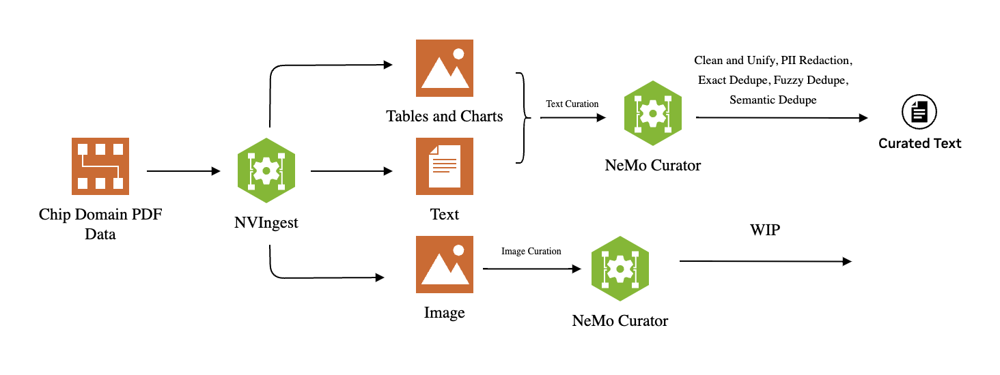

# Multimodal Extraction and Curation

## Workflow

## Overview
This tutorial is divided into two parts:

### Part 1: Multimodal Extraction
In this section, we guide you through extracting various modalities (text, images, tables, etc.) from PDFs using NVIDIA's multimodal extraction (`nv-ingest`) framework. To complete the prerequisites and run the tutorial, refer to the README located in the `ingest` folder within the directory.

### Part 2: Data Curation for Domain-Adaptive Pre-Training (DAPT)
The second part of the tutorial covers best practices for data curation in DAPT. This stage processes extracted text, tables, charts, and images using the curation pipeline. To complete the prerequisites and execute the tutorial, follow the README in the `curator` folder within the directory.

## Instructions
- Ensure that all prerequisites for both `nv-ingest` (extraction) and `curator` (curation) are completed before proceeding.
- Follow the respective READMEs in the `ingest` and `curator` folders for step-by-step guidance.

## License
Refer to the respective repositories for licensing information.
