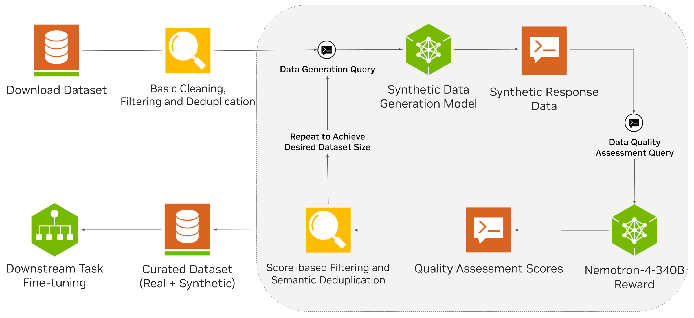

# Curating Datasets for Parameter Efficient Fine-tuning with Synthetic Data Generation

This tutorial demonstrates the usage of NeMo Curator's Python API data curation as well as synthetic
data generation, and qualitative score assignment to prepare a dataset for parameter-efficient fine-tuning (PEFT) of LLMs.

We demonstrate the pipeline using the [Law StackExchange dataset](https://huggingface.co/datasets/ymoslem/Law-StackExchange),
which is a dataset of legal question/answers. Each record consists of a question, some context as
well as human-provided answers.

In this tutorial, we implement various filtering and processing operations on the records. We then
demonstrate the usage of external LLM services for synthetic data generation and reward models to
assign qualitative metrics to each synthetic record. We further use NeMo Curator's facilities
to iteratively augment and refine the data until the dataset has reached the desired size.

> **Note:** The use of external LLM services for synthetic data generation is entirely optional.
> Similarly, this tutorial can be executed on a local machine without the need for a GPU. To fully
> experience all the capabilities of this code, see the "Optional Prerequisites" section below.

## Overview of the Pipeline

The pipeline for this tutorial aims to demonstrate a basic loop with two stages as follows. These stages are repeated until the desired dataset size is achieved:

1. **Data processing**: perform operations such as HTML tag cleaning, quality-based filtering and semantic deduplication on the records.
2. **Synthetic data generation**: query a synthetic data generation model (such as [LLaMa 3.1 405B Instruct](https://build.nvidia.com/meta/llama-3_1-405b-instruct), or [Nemotron-4 340B Instruct](https://build.nvidia.com/nvidia/nemotron-4-340b-instruct)) to produce synthetic variants of existing records. Each synthetic record is then fed to a reward model (such as [Nemotron-4 340B Reward](https://build.nvidia.com/nvidia/nemotron-4-340b-reward)), and assigned a quality score. All records are then fed to the data processing stage for further processing.

The following diagram depicts the pipeline demonstrated in this tutorial:




### Code Structure

This code is organized as follows:
- **[main.py](main.py)**: the entry point to the code. Implements the data curation and synthetic data generation pipeline, and consists of the following high-level functionality:
  - `download_and_convert_to_jsonl()`: contains the logic necessary to download the sample dataset and convert it into JSONL.
  - `random_split_rows()`: contains the logic for spliting the dataset into training/validation/test splits.
  - `semantic_dedupe()`: implements the semantic deduplication functionality (requires an NVIDIA GPU).
  - `run_curation_pipeline()`: the main curation pipeline implementation. Captures the data processing, as well as the synthetic data generation operations.
- **[docbuilder.py](docbuilder.py)**: contains the implementations of NeMo Curator document builder modules to facilitate dataset download and conversion into the JSONL format.
- **[filters.py](filters.py)**: contains the implementation of a score-based filtering mechanism, to filter out low-quality documents. Used in `run_curation_pipeline()`.
- **[modifiers.py](modifiers.py)**: contains the implementation of the HTML-cleaning logic. Used in `run_curation_pipeline()`.
- **[synthetic_gen.py](synthetic_gen.py)**: abstracts the logic needed for invoking the synthetic data generation model, and also assigning reward scores to each record. Used in `run_curation_pipeline()`.

## Optional Prerequisites

The following is a list of optional dependencies to allow experimentation with all the features
showcased in this code:

* In order to run the data curation pipeline with semantic deduplication enabled, you would need an
NVIDIA GPU.
* To generate synthetic data, you would need a synthetic data generation model compatible with the [OpenAI API](https://platform.openai.com/docs/api-reference/introduction). Out of the box, this tutorial supports the following model through the [build.nvidia.com](https://build.nvidia.com) API gateway:
  * [Nemotron-4 340B Instruct](https://build.nvidia.com/nvidia/nemotron-4-340b-instruct)
  * [LLaMa 3.1 405B Instruct](https://build.nvidia.com/meta/llama-3_1-405b-instruct)
* For assigning qualitative metrics to the generated records, you would need a reward model compatible with the [OpenAI API](https://platform.openai.com/docs/api-reference/introduction) (such as the [Nemotron-4 340B Reward](https://build.nvidia.com/nvidia/nemotron-4-340b-reward) model).

> **Note:** A valid [build.nvidia.com](https://build.nvidia.com) API key is required to use any of the above models. You can obtain a free API key by visiting [build.nvidia.com](https://build.nvidia.com) and creating an account with your email address.

## Usage
After installing the NeMo Curator package, you can simply run the following commands:
```bash
# Running the basic pipeline (no GPUs or external LLMs needed)
python tutorials/peft-curation-with-sdg/main.py

# Running with synthetic data generation and semantic dedeuplication using
# an external LLM inference endpoint located at "https://api.example.com/v1/chat/completions"
# and the model called "my-llm-model" that is served at that endpoint:
python tutorials/peft-curation-with-sdg/main.py \
    --synth-gen-endpoint https://api.example.com/v1/chat/completions \
    --synth-gen-model my-llm-model \
    --api-key API_KEY_FOR_LLM_ENDPOINT \
    --device gpu

# Here are some examples that:
# - Use the specified model from build.nvidia.com for synthetic data generation
# - Do 1 round of synthetic data generation
# - Generate synthetic data using 0.1% of the real data
# - Use the GPU and enable semantic deduplication

# Using LLaMa 3.1 405B:
python tutorials/peft-curation-with-sdg/main.py \
    --api-key YOUR_BUILD.NVIDIA.COM_API_KEY \
    --synth-gen-model "meta/llama-3.1-405b-instruct" \
    --synth-gen-rounds 1 \
    --synth-gen-ratio 0.001 \
    --device gpu

# Using Nemotron-4 340B:
python tutorials/peft-curation-with-sdg/main.py \
    --api-key YOUR_BUILD.NVIDIA.COM_API_KEY \
    --synth-gen-model "nvidia/nemotron-4-340b-instruct" \
    --synth-gen-rounds 1 \
    --synth-gen-ratio 0.001 \
    --device gpu
```

By default, this tutorial will use at most 8 workers to run the curation pipeline. If you face any
out of memory issues, you can reduce the number of workers by supplying the `--n-workers=N` argument,
where `N` is the number of workers to spawn.

Once the code finishes executing, the curated dataset will be available under `data/curated/final`.
By default, the script outputs splits for training (80%), validation (10%) and testing (10%).

## Next Step: Fine-tune Your Own Model
The curated dataset from this tutorial can be readily used for model customization and fine-tuning using the [NeMo Framework](https://github.com/NVIDIA/NeMo). Please refer to the [law title generation tutorial](https://github.com/NVIDIA/NeMo/blob/main/tutorials/llm/llama-3/sdg-law-title-generation/llama3-sdg-lora-nemofw.ipynb) in the NeMo Framework repository to learn more. In that tutorial, you will learn more about using the data you just curated to fine-tune a model that can read a legal question and generate a title for that question.
